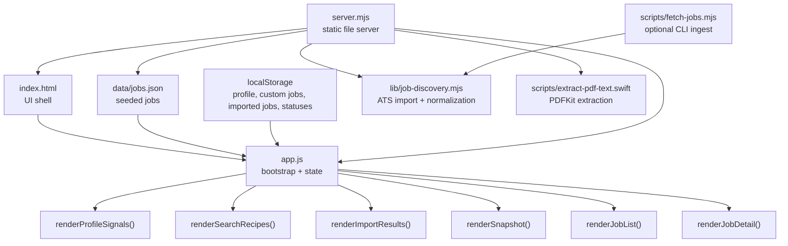

# Frontend Architecture

## Overview

The frontend is a single-page, static app with no framework and no build step. All behavior lives in `app.js`, the markup shell lives in `index.html`, and the styling system lives in `styles.css`.

## Architecture at a glance



## UI structure

`index.html` defines a two-column layout with these major sections:

1. Hero
2. Profile form
3. Search Recipes
4. Import Jobs
5. Add Job form
6. Snapshot and `Apply next` queue
7. Filters
8. Ranked Jobs list
9. Detail panel

The left column is input-oriented. The right side is analysis-oriented.

## State model

`app.js` keeps a single in-memory `state` object:

```js
{
  customJobs: [],
  importedJobs: [],
  importReport: null,
  jobs: [],
  profile: { ... },
  selectedJobId: null,
  statuses: {},
  filters: {
    fit: "all",
    search: "",
    status: "all"
  }
}
```

### State sources

- `jobs`: loaded from `data/jobs.json`
- `customJobs`: restored from `localStorage`
- `importedJobs`: restored from `localStorage`
- `profile`: restored from `localStorage` with defaults
- The profile now includes public links and pasted resume text.
- `statuses`: restored from `localStorage`
- `importReport`: runtime summary of the latest import attempt
- `selectedJobId`: runtime-only selection state
- `filters`: runtime-only filter state

## Bootstrap flow

On `DOMContentLoaded`, the app:

1. caches DOM references
2. restores persisted local state
3. binds UI event listeners
4. loads seeded jobs from `data/jobs.json`
5. selects an initial job if one exists
6. renders the full app

## Rendering model

The app uses a simple full-section rerender pattern. `render()` calls:

- `hydrateForms()`
- `renderProfileSignals()`
- `renderSearchRecipes()`
- `renderImportResults()`
- `renderSnapshot()`
- `renderJobList()`
- `renderJobDetail()`

This is intentionally straightforward for the current size of the app.

### Why this is okay right now

- the data set is small
- the UI is not deeply nested
- complexity is lower than introducing framework state management

### When it may need to change

- larger job datasets
- background fetch and sync
- richer notes or editing flows
- more advanced filtering and sorting controls

## Job data shape

The frontend expects each normalized job to look roughly like this:

```js
{
  id: "ashby-Nash-dc9645ae-dab2-4ed1-8db4-b06ae790f747",
  title: "Senior React Native Engineer",
  company: "Nash",
  location: "Remote HQ",
  remote: true,
  employmentType: "Full-time",
  salaryMin: null,
  salaryMax: null,
  url: "https://jobs.ashbyhq.com/Nash/...",
  description: "Build patient-facing mobile features...",
  skills: ["React Native", "Expo", "TypeScript"],
  postedAt: "2026-03-14",
  source: "ashby",
  sourceLabel: "Ashby",
  sourceUrl: "https://jobs.ashbyhq.com/Nash",
  importedFrom: "https://jobs.ashbyhq.com/Nash/...",
  importedAt: "2026-03-16T22:24:35.086Z",
  externalId: "dc9645ae-dab2-4ed1-8db4-b06ae790f747"
}
```

Normalization happens in `normalizeJob()`.

## Scoring pipeline

Each render computes analyzed jobs from raw jobs plus the active profile:

1. combine seeded jobs and custom jobs
2. merge imported ATS jobs
3. normalize the record shape
4. run `analyzeJob(job, profile)`
5. assign a numeric score
6. assign a fit bucket
7. generate reasons, concerns, pitch bullets, and resume focus bullets
8. sort descending by score and recency

### Current scoring inputs

- title keywords
- target title overlap
- core skill hits
- bonus skill hits
- resume-derived skill hits
- remote signal
- salary floor comparison
- avoid phrases
- native-only warning patterns
- onsite-heavy wording

### Current scoring outputs

- `score`
- `fitBucket`
- `reasons`
- `concerns`
- `pitch`
- `resumeFocus`

## Interaction model

### Profile form

- updates state on input
- persists to `localStorage`
- rerenders the board immediately
- stores LinkedIn, GitHub, portfolio, and resume text alongside search preferences

### Resume import

- reads local `.txt` and `.md` files in the browser
- sends `.pdf` files to the local server for extraction with PDFKit
- copies extracted or uploaded text into the profile
- immediately updates scoring and search recipes

### Import Jobs

- submits pasted URLs to `POST /api/import-jobs`
- uses `lib/job-discovery.mjs` to detect source type and normalize results
- currently supports Greenhouse, Lever, Ashby, and direct job pages with structured data
- filters imported records down to mobile-relevant roles before adding them to state
- persists imported jobs into `localStorage`
- stores the latest import summary in `importReport`

### Add Job form

- creates a custom job from pasted data
- normalizes it
- saves it to `localStorage`
- selects it in the board
- rerenders the board

### Filters

- update in-memory filter state only
- narrow the rendered list without changing stored data

### Status updates

- change a job's pipeline state
- persist into `localStorage`
- affect queue composition and filtering

### Search recipe buttons

- open generated search URLs in a new tab

### Export queue

- serializes the current apply queue to JSON
- downloads it as `job-optimizer-queue.json`

## Persistence model

There is no server-side persistence.

Browser persistence is split across four `localStorage` keys:

- `job-optimizer-profile`
- `job-optimizer-custom-jobs`
- `job-optimizer-imported-jobs`
- `job-optimizer-statuses`

This keeps the app portable and easy to reset, but it also means data is browser-local.

## Styling system

`styles.css` provides:

- a warm editorial palette
- glassmorphism-like panels
- a strong two-column layout
- responsive collapse for tablet and mobile
- reusable button, chip, pill, queue, and card styles

The UI direction is intentionally more distinctive than a default admin dashboard.

## Current backend boundary

There is no application backend yet. The only Node-side logic today is:

- `server.mjs` for serving static files
- `server.mjs` also exposes a local PDF extraction endpoint for resume imports
- `server.mjs` exposes `POST /api/import-jobs` for ATS and direct job imports
- `lib/job-discovery.mjs` holds source detection, ATS fetches, normalization, and relevance filtering
- `scripts/fetch-jobs.mjs` is the CLI wrapper around that same importer logic

## Practical next refactor points

If we continue growing this frontend, likely refactor targets are:

- extract scoring into its own module
- extract render functions into smaller view modules
- separate data loading from UI rendering
- add typed schemas or validation for job records
- add tests around importer normalization and relevance filtering
- move persistence behind a storage layer
- introduce tests around scoring behavior
